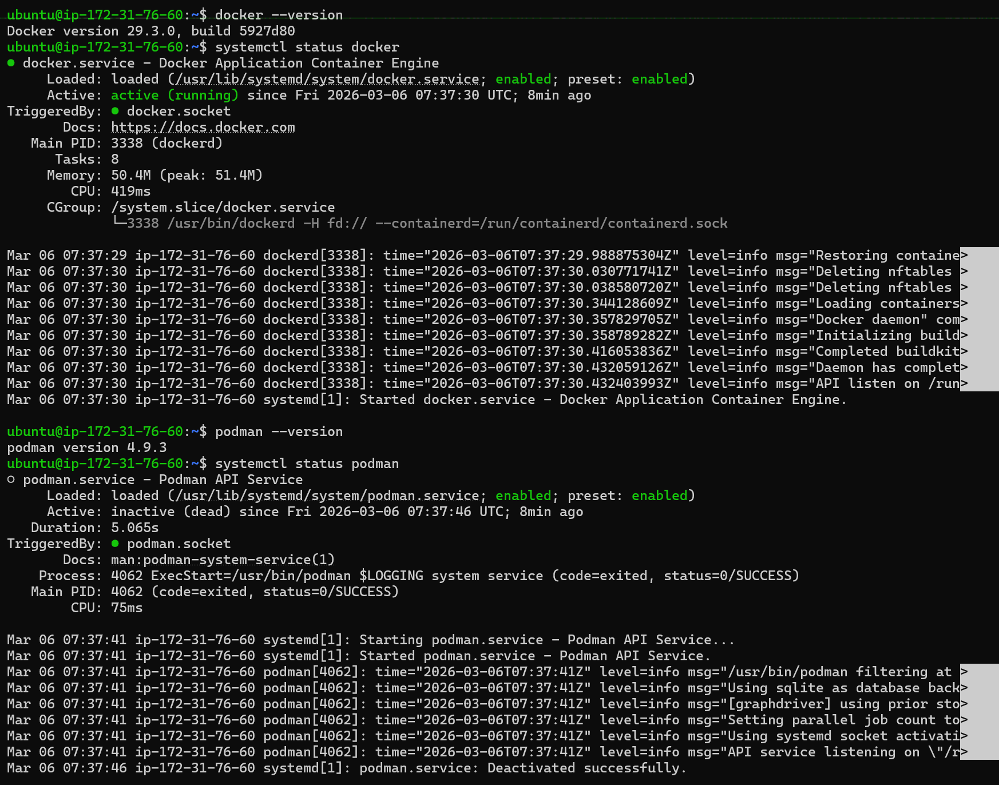
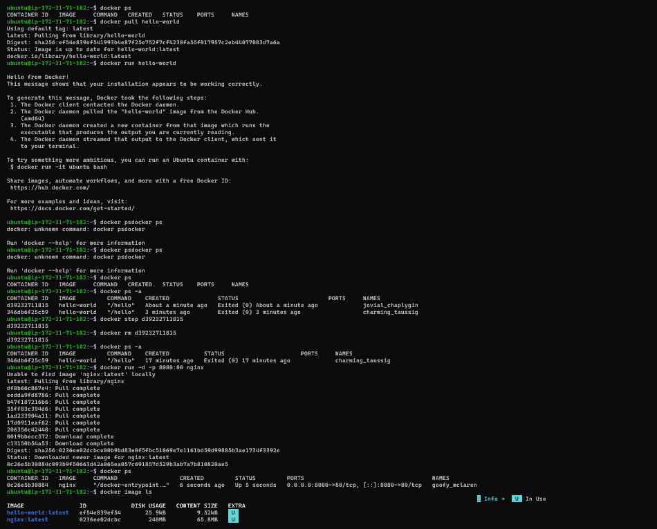
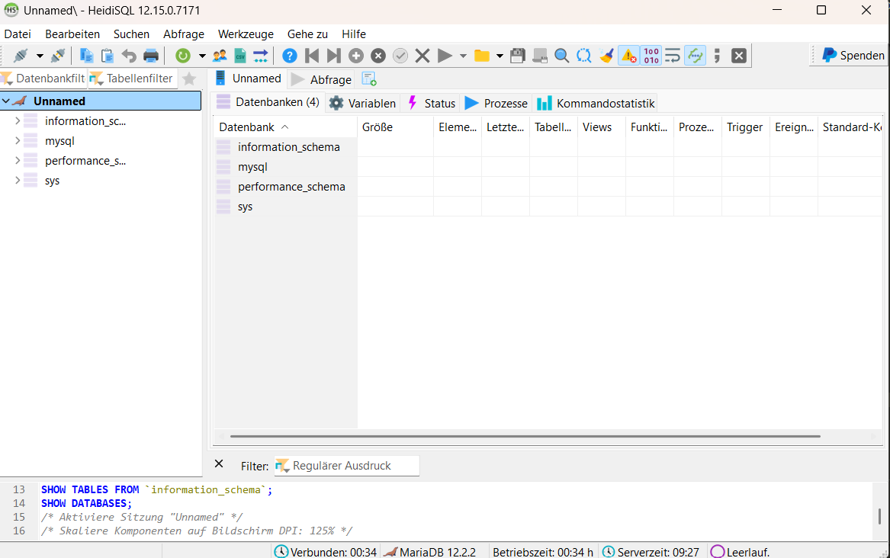
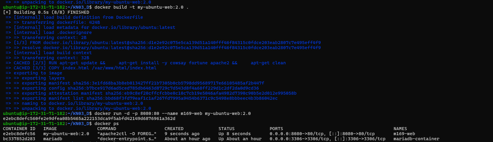
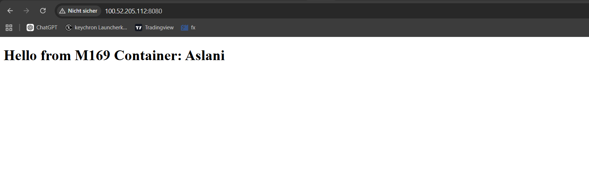
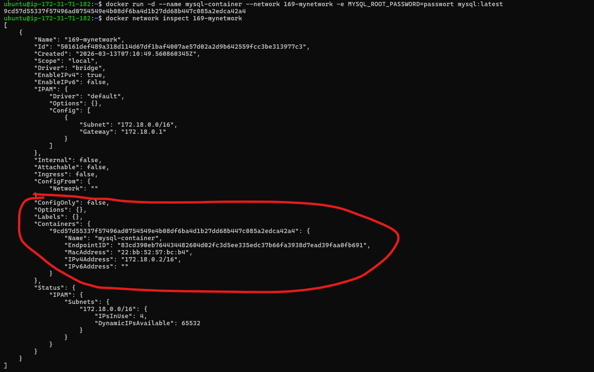

### Challenge A: AWS EC2 Instanz aufsetzen
 

#### Unterschied zwischen Docker und Podman

##### Docker
Docker ist eine Container-Plattform mit **Client-Server-Architektur**.  
Es nutzt einen **Docker-Daemon**, der ständig im Hintergrund läuft und Container verwaltet.

##### Podman
Podman ist ebenfalls eine Container-Engine, arbeitet aber **daemonlos**.  
Container werden direkt als normale Prozesse gestartet und können auch **ohne Root-Rechte (rootless)** laufen.

##### Warum ist der Podman-Dienst "inactive"?
Podman benötigt **keinen dauerhaft laufenden Hintergrunddienst**.  
Der Dienst ist deshalb oft *inactive*, weil Container nur gestartet werden, wenn ein Benutzer einen Befehl ausführt.

##### Vorteile von Podman
- höhere Sicherheit (kein Root-Daemon)
- rootless Nutzung möglich
- weniger Ressourcenverbrauch
- bessere Integration in Linux
 
### Challenge B: OCI-Images Basics

Befehle die ich eingegeben habe: 

Nginx hat erfolgreich funktioniert:

# Docker – Fragen und Antworten

## 1. Unterschied zwischen Image und Container
Ein **Image** ist eine Vorlage oder ein Bauplan für eine Anwendung. Es enthält alles, was benötigt wird, um ein Programm auszuführen (Code, Bibliotheken, Einstellungen).

Ein **Container** ist eine laufende Instanz eines Images. Das bedeutet: Aus einem Image kann man einen oder mehrere Container starten, die dann die Anwendung tatsächlich ausführen.

## 2. Warum ist eine Registry wie Docker Hub wichtig?
Eine Registry wie Docker Hub ist ein Online-Speicher für Docker Images.  
Dort können Images gespeichert, geteilt und heruntergeladen werden.

Vorteile:
- einfache Verteilung von Anwendungen
- schneller Zugriff auf fertige Images
- Zusammenarbeit zwischen Entwicklern

## 3. Vorteile der Isolation von Containern
Container laufen isoliert voneinander und vom Host-System.

Vorteile:
- Anwendungen beeinflussen sich nicht gegenseitig
- höhere Sicherheit
- verschiedene Versionen von Software können parallel laufen
- einfachere Bereitstellung und Verwaltung
 
### Challenge C: MariaDB Docker Lab

Hier sind die Befehle die ich verwendet habe um den Mariadb Server zuzugreifen:

Hier habe ich den container ins HeidiSQL hinzugefügt und es hat erfolgreich funktioniert:

 
### Challenge D: Dockerfile – Build & Customization

Hier habe ich ein Dockerfile und ein inex.html verwendet:

#### Dockerfile

 Basis-Image
FROM ubuntu:latest

 Metadaten
LABEL maintainer="M169_KN03_XXX <email@example.com>"

 Pakete installieren
RUN apt-get update && \
    apt-get install -y cowsay fortune apache2 && \
    apt-get clean

 Persönliche index.html kopieren
COPY index.html /var/www/html/index.html

 Apache im Vordergrund starten
CMD ["apache2ctl", "-D", "FOREGROUND"]

**hier kann man die Befehle sehen die ich es fürs Laufen des Container verwendet habe**

**Hier sieht man das es Erfolgreich funktioniert hat:**

#### Unterschied: Manuelle Container-Anpassung vs. Dockerfile-Build

| Merkmal | Manuelle Anpassung | Dockerfile / automatisiertes Image |
|---------|-----------------|----------------------------------|
| **Vorgehensweise** | Container starten → direkt Änderungen im laufenden Container vornehmen (z. B. Pakete installieren, Dateien hinzufügen) | Dockerfile schreiben → `docker build` ausführen → Image automatisch erstellt |
| **Reproduzierbarkeit** | **Nicht reproduzierbar**: Jeder Container ist individuell, schwer zu kopieren | **Reproduzierbar**: Jeder Build aus dem Dockerfile erzeugt identisches Image |
| **Dokumentation der Änderungen** | Änderungen müssen **manuell dokumentiert** werden (Befehle, installierte Pakete) | Dockerfile selbst **dokumentiert alle Schritte**, automatisch nachvollziehbar |
| **Flexibilität** | Schnell Änderungen testen, aber schwer zu versionieren | Änderungen müssen im Dockerfile angepasst werden → leichter Versionierung / CI/CD |
| **Nachhaltigkeit** | Nach Container-Löschung gehen Änderungen verloren, wenn nicht committed | Image speichert alle Layer → Änderungen bleiben verfügbar, neue Container können daraus erstellt werden |
| **Zeitaufwand** | Gut für kleine Experimente | Besser für strukturierte, wiederholbare Deployments |

### Challenge E: Container Netzwerk

Um alle Netzwerke zu zeigen benutzt man den Befehl Docker network ls:

Hier habe ich ein Bild das zeigt wie man die entsprechende IP Adresse des einen Netzwerks sehen kann:

Netzwerk erstellen und prüfen ob der Existiert:

Als letztes habe ich noch den Mysql Container mit meinem Netzwerk verdbunden. Hier kann man es sehen das es verbunden worden ist:

