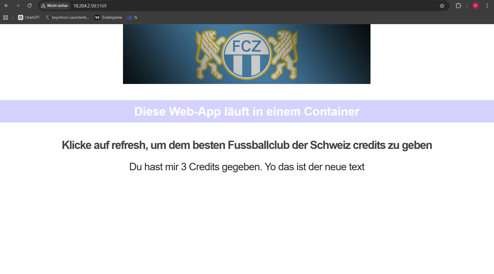
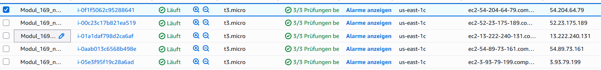
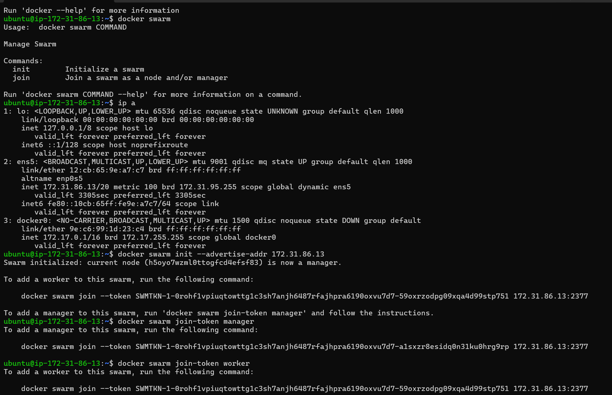
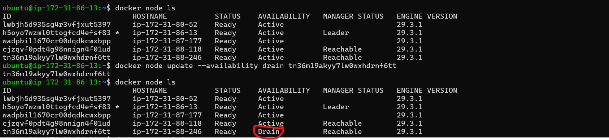
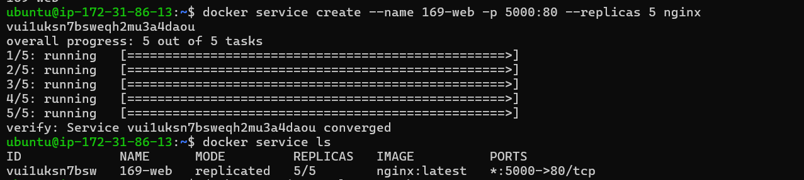
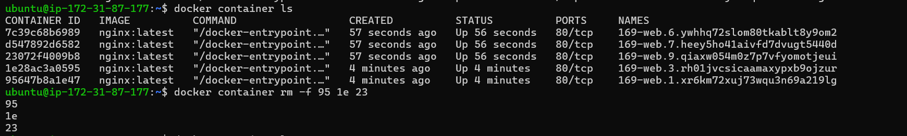
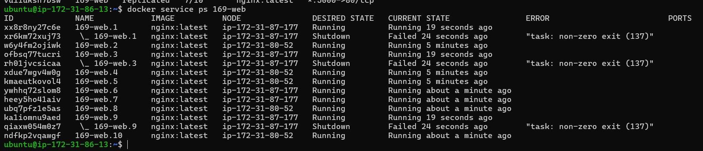
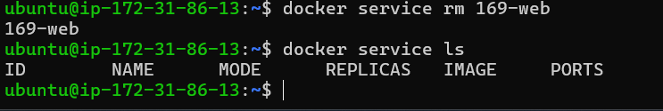

# A) Docker Image aufsetzen, in Registry ablegen und deployen - OCI: BASIC WORKFLOW

1. Teil-Challenge

Die vorherige Webseite Code:

Hier kann man es sehen das es sich verändert habe sobald ich den Image gelöscht und wieder erstellt habe:

Die Endaufgabe in diesem Teil bestand darin, das Bild von „TBZ Cloud Native” auf Modul 169 zu ändern und den violetten Balken in einen goldenen Balken umzuwandeln. Dazu muss man in der entsprechenden CSS-Datei die Farbe des Balkens ändern und das Bild im entsprechenden Ordner kopieren und mit dem Pfad speichern. So sieht es aus, wenn ich diese Webseite abändere:

# B) Docker Compose - Container Orchestrierung mit mehreren Services - CONTAINER MANAGEMENT:

1. Zuerst habe ich den automatisierten Container gestartet. Man kann sehen das die entsprechende Images und Container erstellt worden sind
 

2. Hier kann man sehen das das entsprechende Netzwerk erstellt worden ist, indem man in das entsprechende Netzwerk hinein schaut welche Subnetzmaske es hat.

3. Natürlich wurde auch der entsprechende Volumen erstellt

4. Jetzt sollte man auf eine webseite erscheinen die uns zeigen kann das es jedes mal die Credit Zahl um 1 vergrössert

Vorher:

nach dem neustarten

Bei der Challange habe ich den Compose file und die Inex.html file angepasst und auch den richtigen port festgelegt:

Hier ist die Lösung zu dieser aufgabe:

 # C) Docker Swarm Cluster aufsetzen - SETUP HIGH AVAILABILITY PLATFORM

 Zuerst habe ich 5 Instanzen mit diesen Einstellungen erstellt:

Dann habe ich einen Docker Swarm bei einer Insanz erstellt und die Tokens herausgegeben:

Ich konnte alle Instanzen zu den entsprechenden Worker und Manager swarm hinzufügen hier sieht man die liste meiner instanzen

Hier sieht man das der Drain zu einen  Entsprechender Instanz funktinoert hat:

# D) Docker Swarm Imperativ - CONTAINER ORCHESTRATION: ENTRY-LEVEL

Zuerst habe ich auf einen Manager Node einen service erstellt:

Als nächstes kann man mit der öffentliche IP adresse un den anderen port eingeben und man sollte auf der Nginx webseite zugreifen:

ich habe dies auf 10 skaliert und einen self healing gemacht hier sind bilder dazu:

und als letztes habe ich diesen service gelöscht:

# E) Docker Swarm Deklarativ - CONTAINER ORCHESTRATION: ADVANCED-LEVEL

