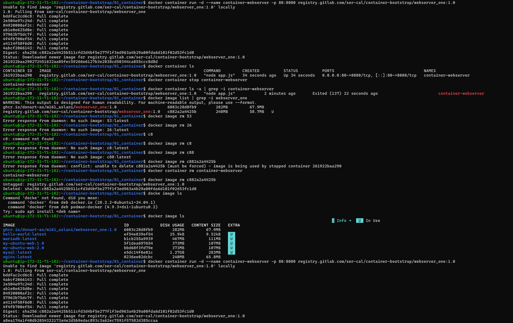
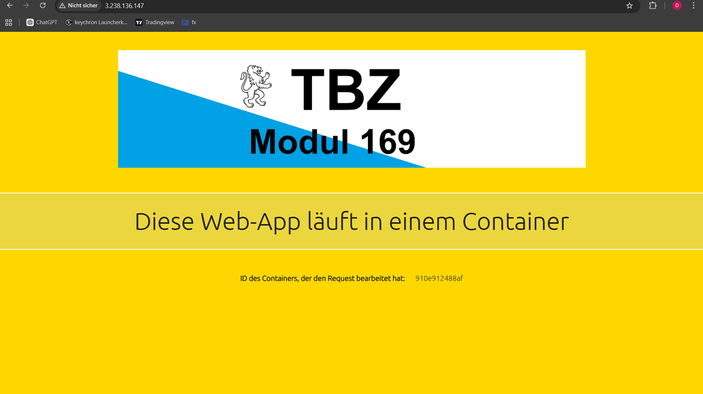

# A) Docker Image aufsetzen, in Registry ablegen und deployen - OCI: BASIC WORKFLOW

1. Teil-Challenge

Die vorherige Webseite Code:

Hier kann man es sehen das es sich verändert habe sobald ich den Image gelöscht und wieder erstellt habe:

Die Endaufgabe in diesem Teil bestand darin, das Bild von „TBZ Cloud Native” auf Modul 169 zu ändern und den violetten Balken in einen goldenen Balken umzuwandeln. Dazu muss man in der entsprechenden CSS-Datei die Farbe des Balkens ändern und das Bild im entsprechenden Ordner kopieren und mit dem Pfad speichern. So sieht es aus, wenn ich diese Webseite abändere:

